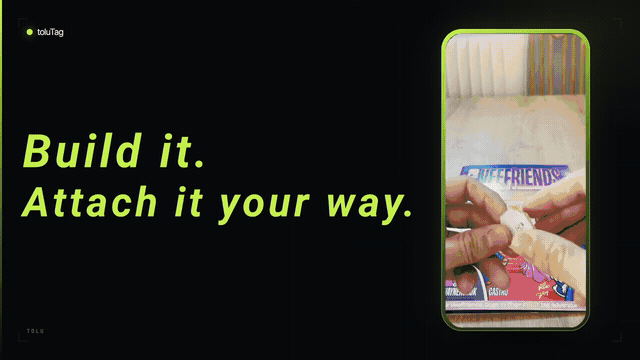
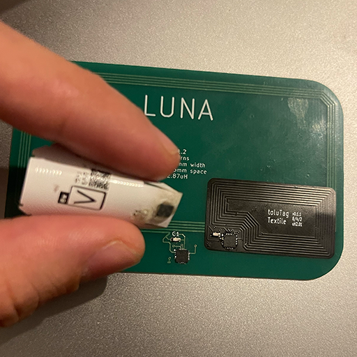

# toluTag

***T**ouch-point **O**n-chain **L**inked **U**niverse. Bridging the physical world to decentralized, on-chain validation.*



Open tooling for provisioning and using **NXP SE05x** secure elements as
NFC-readable Ethereum signers.

toluTag is the **root of trust** that links a real-world object to on-chain
validation. The tag is the primitive; what you build on top is up to you.

A toluTag is a passive NFC tag carrying an SE05x secure element. A
secp256k1 key pair is generated **on the chip** and never leaves it; the private
key is not extractable by design. The chip's public key yields an Ethereum
address, and the chip can sign EIP-191 messages and EIP-712 typed data on
demand, so a physical object can produce signatures that any Ethereum verifier
(on-chain or off-chain) can check against a fixed address.

There is **no server in the trust path**: a verifier checks the signature
directly against the chip's address, on-chain or locally. No central
authority to spoof, go down, or disappear, and verification keeps working even
if the original issuer no longer exists.

This repository holds two independent clients that speak the same SE05x APDU
protocol:

| Component | Platform | Transport | Purpose |
|---|---|---|---|
| [`Software/IOS`](Software/IOS/toluTag) | iOS 26, SwiftUI | CoreNFC (`NFCTagReaderSession`, ISO 7816) | Field app: provision, inspect and sign with a tag from a phone |
| [`Software/Java`](Software/Java) | Java 21, CLI | PC/SC (`javax.smartcardio`) | Desktop/bench tooling: batch provisioning, deep inspection, encoder self-tests |

Neither component has third-party dependencies. Keccak-256, secp256k1 public-key
recovery, DER parsing, RLP-free EIP-191/712 encoding and the SE05x TLV/APDU layer
are all implemented directly in this repo, in both languages.

---

## Free dev kit

Want to try a toluTag without building one first? Request a dev kit at
**[tolu.network](https://tolu.network)** and experiment with a real tag.

---

## Shape the tag however you need

A toluTag is only two things that matter: the SE051C secure element and an NFC
antenna tuned around it. Everything else is carrier. That leaves the outline
free, so the tag can take the shape of the product it authenticates instead of
forcing the product to make room for a tag. Change the board outline, keep the
antenna geometry tuned, and the same key hierarchy, the same applet and the same
apps work unchanged.

Two reference builds are in this repository.

**1. PCB board.** A rigid FR4 board, the card form factor in
`Hardware/PCB/card/`. This is the one to start with: easiest to fabricate,
easiest to hand-solder, and the most forgiving to probe while bringing a design
up. Good for cards, tokens, coins, tags hung off a product, and anything with a
flat place to sit.

**2. Flex board.** The same circuit on flexible polyimide, in
`Hardware/PCB/sticker/` and `Hardware/PCB/textile/`. Because it bends and is
fractions of a millimetre thick, one design covers three very different
products: a **sticker** applied to a finished item, a **textile** tag sewn or
heat-pressed into clothing and bags, or a tag **embedded** into the object
during manufacture, under resin or behind a laminate, where it is invisible and
cannot be removed without destroying the item. That last case is the
interesting one: the physical bond between object and key becomes as strong as
the object itself.



In every case the flow is the same: scanning produces an ECDSA signature over a
timestamped message, a smart contract checks that it comes from an authorized
tag, and only then does the experience open. The gating lives in the contract,
not in the app. Signatures are timestamped and accepted only within a tight
window, so a captured signature can't be replayed later.

---

## Built on toluTag: 0xLimited

**[0xLimited](https://github.com/mwbpNFTechnology/0xLimited)** is the first way to put
toluTag to work on physical products. It pairs a physical item with an on-chain
digital twin: attach a tag to a product, register its address in a product smart
contract, and scanning the tag mints an NFT twin bound to that specific tag.
From then on the physical item has a verifiable digital identity.

The 0xLimited repo ships an open smart-contract template plus a site that lets
you create a product contract and link tags without writing code. It is a
separate project that builds on the tag primitive in this repo.

**[Explore 0xLimited](https://github.com/mwbpNFTechnology/0xLimited)**

---

## How it works

### The applet

Both clients select the SE05x IoT applet
(AID `A0000003965453000000010300000000`) over ISO 7816-4 and then speak the
SE05x command set: `WriteSecureObject`, `ReadSecureObject`, `CryptoObject` /
`Signature`, `ManageSession`, `DeleteSecureObject`. Everything is TLV-encoded
under tags `0x41`/`0x42`/`0x43`.

### secp256k1 on an SE05x

The SE05x supports arbitrary Weierstrass curves but ships without secp256k1
provisioned. Both clients therefore:

1. Create the curve id for secp256k1 and push its parameters (`p`, `a`, `b`,
   `G`, `n`) one at a time, idempotently, so a tag that already carries the
   curve is left alone.
2. Generate an EC key pair at a caller-chosen 4-byte **object id**
   (e.g. `00002222`), optionally under a policy.
3. Read back the uncompressed public point, `keccak256(X‖Y)[12..]` → the tag's
   Ethereum address.

### Object policies

Keys are created with an explicit policy. By default the `DELETE` permission is
**omitted**, meaning the object can never be wiped from the tag, the binding
between chip and address is permanent. A deletable variant is available for
development tags.

Keys may additionally be bound to a **UserID authentication object** holding a
PIN. Using such a key requires opening an authenticated session
(`ManageSession` → verify PIN) and wrapping every subsequent command in a
`ProcessSessionCmd`. Both clients handle this transparently once a session is
open.

### Signing

The chip signs a 32-byte digest with `ECDSA_SHA256` and returns a DER
`SEQUENCE { INTEGER r, INTEGER s }`. The client then:

- parses `r`/`s` from DER,
- recovers the recovery id `v` by trying each candidate and comparing the
  recovered address to the chip's own address (rather than assuming a value),
- normalises `s` and emits Ethereum-ready `r`/`s`/`v`.

Two payload shapes are supported:

- **EIP-191** (`personal_sign`), including the toluTag phrase template
  `<address>_<uniqueId>_<value>`, where `address` is the chip's own address or a
  caller-supplied `msg.sender`, and `uniqueId` is the SE05x factory-unique chip
  id.
- **EIP-712**: any standard `eth_signTypedData_v4` document
  (`{types, primaryType, domain, message}`), the same shape MetaMask and ethers
  produce. The token `{{signer}}` anywhere in the JSON is substituted with the
  chip's address before encoding, so a `signer` field can reference the key that
  signs it.

---

## Repository layout

```
toluTag/
├── Software/
│   ├── IOS/toluTag/            # SwiftUI iOS app (Xcode project)
│   │   └── toluTag/
│   │       ├── Core/SE05x/     # applet constants, TLV, curve params, object ids, policies
│   │       ├── Core/NFC/       # CoreNFC session runner + Se05xTag read/write/sign
│   │       ├── Core/Crypto/    # Keccak256, secp256k1, BigUInt, EIP-191/712, address
│   │       ├── Features/       # Write / Read / Keys flows (View + @Observable ViewModel)
│   │       ├── Components/     # design-system views (buttons, hex fields, radar, …)
│   │       ├── Theme/          # ToluTheme, palette
│   │       ├── Services/       # KeyStore (Keychain + Face ID gate)
│   │       └── Navigation/     # AppRoute, Router
│   └── Java/                   # Java 21 / Maven CLI toolkit
│       └── src/main/java/org/example/tolutag/
│           ├── smartcard/      # PC/SC connection, channel, APDU errors
│           ├── se05x/          # applet services: keys, objects, sessions, curve, info
│           ├── eth/            # address, EIP-191, EIP-712 encoder + signers
│           ├── crypto/         # Keccak256, DER ECDSA, secp256k1 recovery
│           └── cli/            # interactive entry points (read/ and write/)
└── Hardware/
    ├── PCB/                    # card, sticker and textile form factors
    ├── STL/                    # printable models (tag carriers)
    └── BOM.md                  # bill of materials
```

---

## iOS app

Published on the App Store:
**[toluTag](https://apps.apple.com/il/app/tolutag/id6807511676)**. Install it to
provision, inspect and sign with a tag from an iPhone, no build required. The
source here is the same app.

### Requirements

- Xcode 26+, iOS 26.0 target, Swift 5
- A physical iPhone with NFC (CoreNFC does not work in the Simulator)
- A paid Apple Developer account, the app needs the **NFC Tag Reading**
  capability and an entitlement whitelisting the SE05x AID

### Entitlements

`Info.plist` declares the applet the app is allowed to select:

```xml
<key>com.apple.developer.nfc.readersession.iso7816.select-identifiers</key>
<array>
    <string>A0000003965453000000010300000000</string>
</array>
```

`toluTag.entitlements` must carry `com.apple.developer.nfc.readersession.formats`
with `TAG`, and the provisioning profile must include the NFC capability.

### Build

```bash
open Software/IOS/toluTag/toluTag.xcodeproj
```

Set your own team and bundle id (currently `io.mwbp.toluTag`), then run on a
device.

### Features

**Write**

- *Create key*, provision the secp256k1 curve and generate a key pair at a
  chosen object id, optionally PIN-protected (creating or reusing a UserID
  object) and optionally deletable.
- *Write text*, store an arbitrary string in a binary file object on the tag.
- *Delete*, remove an object, pre-fillable from a saved record (carrying its
  PIN/UserID so the session can authorise the delete).

**Read**

- *Scan tag*, chip unique id, applet version, free memory, and per-object
  existence, type, size, origin (generated on-chip vs imported), policy, public
  point and derived Ethereum address. Every read is independent and best-effort:
  a rejected command is reported and the scan continues.
- *Read text*, read back a stored string.
- *Sign message*, EIP-191 signature over the toluTag phrase template or a
  custom message.
- *Sign typed data*, paste an `eth_signTypedData_v4` document and sign it.
- *Collect tags*, a two-stage batch flow: configure an object id, phrase format
  and label, then tap tags one after another. Each tag's address and unique id
  are read, duplicates rejected, and the whole set saved as an exportable
  record.

**Keys**, records of created keys and stored strings, persisted in the Keychain
and gated behind Face ID.

---

## Java CLI (`Software/Java`)

### Requirements

- JDK 21+
- Maven 3.9+
- A PC/SC contactless reader (e.g. ACR122U, PN532-based readers) with the
  platform's PC/SC daemon running (`pcscd` on Linux; built in on macOS/Windows)

### Build

```bash
cd Software/Java
mvn compile
```

### Run

Each tool is an interactive entry point with its own `main`. Run them from the
compiled classes:

```bash
java -cp target/classes org.example.tolutag.cli.<package>.<Tool>
```

| Tool | Class | What it does |
|---|---|---|
| Create key | `cli.write.secp256k1Create` | Provision curve + generate a key pair, optionally deletion-protected |
| Create PIN-protected key | `cli.write.secp256k1PinProtectCreate` | As above, bound to a UserID object holding a PIN (an existing user object is reused) |
| Write string | `cli.write.writeString` | Store a string in a binary object |
| Delete object | `cli.write.deleteObject` | Remove an object (PIN session if required) |
| Scan details | `cli.read.scanDetails` | Full chip + object report |
| Read string | `cli.read.readString` | Read a stored string back |
| Sign (EIP-191) | `cli.read.ethereumSign` | Sign the toluTag phrase template or a custom message |
| Sign (EIP-712) | `cli.read.eip712Sign` | Sign a pasted `eth_signTypedData_v4` document |
| Collect tags | `cli.read.collectTags` | Batch-read many tags into `tags.json` |

Every tool that touches an object first asks whether it is PIN-protected; leave
the prompt blank for unprotected objects.

**Encoder self-test**, verify the EIP-712 implementation without any hardware:

```bash
java -cp target/classes org.example.tolutag.cli.read.eip712Sign selftest
```

This prints the digest of the canonical EIP-712 "Mail" example for cross-checking
against a reference implementation.

### `tags.json`

`collectTags` (and the iOS *Collect tags* flow) emit the same structure:

```json
{
  "objectId": "00002222",
  "format": "address_tagId_timestamp",
  "count": 3,
  "tags": [
    {
      "index": 0,
      "tagId": "0x00000400500138D472B915A6C7045A8482062090",
      "address": "0xee6ce30a5b4cd7eade1d6ec82f470c9a7040be27",
      "value": "1788259398",
      "phrase": "0xee6ce30a5b4cd7eade1d6ec82f470c9a7040be27_0x00000400500138D472B915A6C7045A8482062090_1788259398"
    }
  ]
}
```

`format` is one of `address_tagId_timestamp`, `address_tagId_0` or
`address_tagId_count`; `phrase` is exactly the string a tag is asked to sign, so
the file doubles as the input list for a batch registration or allowlist.

---

## Hardware

The `Hardware/` directory holds the KiCad projects, gerbers, STLs and BOM for
building a toluTag yourself. Licensed under CERN-OHL-P-2.0.

`Hardware/PCB/` carries the three board projects (`card`, `sticker`, `textile`)
described under [Shape the tag however you need](#shape-the-tag-however-you-need),
`Hardware/STL/` holds printable carriers for them, and `Hardware/BOM.md` lists
what goes into one tag.

---

## Notes

- **Object ids** are 4 bytes, entered as up to 8 hex characters and left-padded
  (`2222` → `00002222`). The two clients use the same convention, so a tag
  provisioned from the CLI reads correctly in the app and vice versa.
- **Non-deletable by default.** Keys created without the `DELETE` permission
  cannot be removed from the tag by any command. Use the deletable variant for
  development tags.
- **PIN attempts** on a UserID object are limited by the applet; exhausting them
  can lock the protected object permanently.
- `tags.json` in the repo is sample output, not configuration.

## Status

Working tooling under active development. APDU-level behaviour has been checked
against real SE05x hardware; the cryptographic layers are cross-checked between
the Swift and Java implementations and, for EIP-712, against the reference
"Mail" vector.

## License

| Part | License |
|---|---|
| Software (`Software/`) | [MIT](LICENSE-SOFTWARE) |
| Hardware (`Hardware/`) | [CERN-OHL-P-2.0](LICENSE-HARDWARE) |

---

<sub>
toluTag hardware and the tooling in this repo are open, build and use freely.
Some higher-level applications built on top of the tag are patented and available
via the Portal platform.
</sub>

<sub>toluTag is part of the Portal platform, built by [mwbp.io](https://x.com/mwbp_io).</sub>
